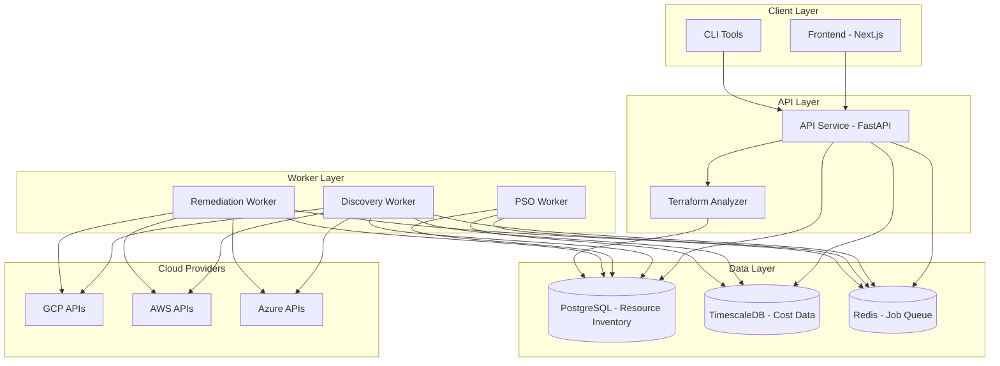
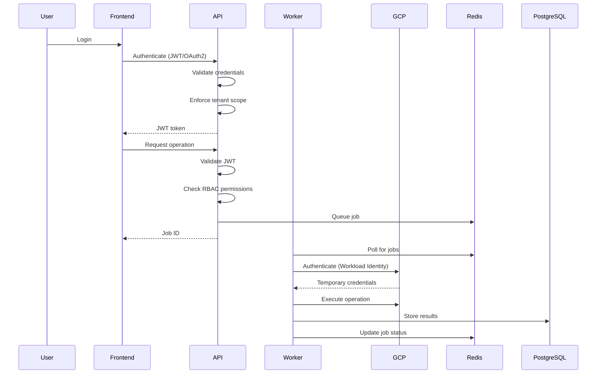

# Design Document: Cloud Cost Optimizer

## Overview

The Cloud Cost Optimization Platform is a distributed, multi-tenant system that discovers cloud resources, analyzes them using Particle Swarm Optimization (PSO) algorithms, and provides human-gated automated remediation. The platform emphasizes security through credential-less authentication, auditability through immutable logging, and safety through blast radius controls and rollback capabilities.

The system consists of six primary components:
- **API Service**: FastAPI-based HTTP service handling authentication, request routing, and job queuing
- **Discovery Worker**: Celery worker that discovers cloud resources and stores inventory/cost data
- **PSO Worker**: Celery worker executing optimization algorithms to generate recommendations
- **Remediation Worker**: Celery worker that executes approved infrastructure changes with safety controls
- **Terraform Analyzer**: Standalone service for parsing and analyzing Terraform HCL files
- **Frontend**: Next.js web application providing the user interface

The architecture uses PostgreSQL for relational data, TimescaleDB for time-series cost data, Redis for job queuing and caching, and Celery for distributed task processing.

## Architecture

### System Architecture Diagram



### Authentication Flow



### Data Flow

1. **Discovery Flow**: Discovery Worker → Cloud APIs → PostgreSQL (inventory) + TimescaleDB (costs)
2. **Analysis Flow**: PSO Worker → PostgreSQL (read inventory) → PostgreSQL (write recommendations)
3. **Remediation Flow**: Remediation Worker → PostgreSQL (read approved recommendations) → Cloud APIs (apply changes) → PostgreSQL (update status)
4. **Query Flow**: Frontend → API Service → PostgreSQL/TimescaleDB → Frontend

## Components and Interfaces

### API Service

**Responsibilities**:
- Authenticate users and enforce tenant-scoped access
- Validate HTTP requests and return structured responses
- Queue jobs to Redis for asynchronous processing
- Serve real-time job status from Redis
- Enforce role-based access control (RBAC)

**Technology**: FastAPI (Python), Pydantic for validation, JWT for authentication

**Key Interfaces**:

```python
# Authentication
POST /api/v1/auth/login
  Request: { email: str, password: str }
  Response: { access_token: str, refresh_token: str, expires_in: int }

POST /api/v1/auth/refresh
  Request: { refresh_token: str }
  Response: { access_token: str, expires_in: int }

# Resource Inventory
GET /api/v1/resources
  Query: { cloud_provider?: str, resource_type?: str, tags?: dict, page: int, limit: int }
  Response: { resources: Resource[], total: int, page: int }

GET /api/v1/resources/{resource_id}
  Response: Resource

# Recommendations
GET /api/v1/recommendations
  Query: { status?: str, min_savings?: float, sort_by?: str, page: int, limit: int }
  Response: { recommendations: Recommendation[], total: int, page: int }

POST /api/v1/recommendations/{rec_id}/approve
  Request: { approver_notes?: str }
  Response: { job_id: str, status: str }

POST /api/v1/recommendations/{rec_id}/reject
  Request: { rejection_reason: str }
  Response: { success: bool }

# Cost Data
GET /api/v1/costs/timeseries
  Query: { start_date: date, end_date: date, granularity: str, group_by?: str }
  Response: { data_points: CostDataPoint[], aggregations: dict }

GET /api/v1/costs/forecast
  Query: { days_ahead: int, confidence_level: float }
  Response: { forecast: ForecastPoint[], confidence_intervals: dict }

# Jobs
GET /api/v1/jobs/{job_id}
  Response: { job_id: str, status: str, progress: float, result?: any, error?: str }

# Audit Logs
GET /api/v1/audit
  Query: { start_date?: date, end_date?: date, actor?: str, action_type?: str, page: int, limit: int }
  Response: { logs: AuditLogEntry[], total: int, page: int }

# Terraform Analysis
POST /api/v1/terraform/analyze
  Request: { files: { filename: str, content: str }[], context?: dict }
  Response: { job_id: str }

GET /api/v1/terraform/results/{job_id}
  Response: { recommendations: TerraformRecommendation[], issues: TerraformIssue[] }

# Natural Language Queries
POST /api/v1/query/nl
  Request: { query: str, context?: dict }
  Response: { answer: str, visualizations?: any[], clarifications?: str[] }
```

### Discovery Worker

**Responsibilities**:
- Authenticate to cloud providers using credential-less methods (Workload Identity, IAM Roles, Managed Identities)
- Discover all resources across configured cloud providers
- Store resource metadata in PostgreSQL
- Store cost data in TimescaleDB with hourly granularity
- Tag all resources with tenant identifiers
- Update audit logs for all discovery operations

**Technology**: Celery (Python), cloud provider SDKs (google-cloud-sdk, boto3, azure-sdk)

**Key Functions**:

```python
@celery_app.task
def discover_gcp_resources(tenant_id: str, project_ids: List[str]) -> DiscoveryResult:
    """
    Discover all GCP resources for a tenant.
    Uses Workload Identity Federation for authentication.
    """
    pass

@celery_app.task
def discover_aws_resources(tenant_id: str, account_ids: List[str]) -> DiscoveryResult:
    """
    Discover all AWS resources for a tenant.
    Uses IAM roles with temporary credentials.
    """
    pass

@celery_app.task
def discover_azure_resources(tenant_id: str, subscription_ids: List[str]) -> DiscoveryResult:
    """
    Discover all Azure resources for a tenant.
    Uses Managed Identities with temporary credentials.
    """
    pass

def store_resource_inventory(resources: List[Resource], tenant_id: str) -> None:
    """Store discovered resources in PostgreSQL with tenant isolation."""
    pass

def store_cost_data(cost_data: List[CostDataPoint], tenant_id: str) -> None:
    """Store cost data in TimescaleDB with hourly granularity."""
    pass
```

### PSO Worker

**Responsibilities**:
- Execute Particle Swarm Optimization algorithms against resource inventory
- Generate recommendations with confidence scores and savings estimates
- Incorporate feedback from approved/rejected recommendations
- Correlate resources across cloud providers for multi-cloud optimization
- Run as scheduled nightly jobs via cron

**Technology**: Celery (Python), NumPy/SciPy for PSO algorithms

**Key Functions**:

```python
@celery_app.task
def run_pso_analysis(tenant_id: str, config: PSOConfig) -> AnalysisResult:
    """
    Execute PSO algorithm to identify cost optimization opportunities.
    """
    pass

def generate_recommendations(
    optimization_results: List[OptimizationOpportunity],
    tenant_id: str
) -> List[Recommendation]:
    """
    Convert PSO results into actionable recommendations with confidence scores.
    """
    pass

def calculate_confidence_score(
    opportunity: OptimizationOpportunity,
    historical_feedback: List[Feedback]
) -> float:
    """
    Calculate confidence score (0-100) based on PSO results and historical feedback.
    """
    pass

def correlate_multi_cloud_resources(
    resources: List[Resource]
) -> List[ResourceCorrelation]:
    """
    Identify logical relationships between resources across cloud providers.
    """
    pass
```

### Remediation Worker

**Responsibilities**:
- Execute approved recommendations with safety controls
- Create snapshots before applying changes
- Automatically rollback on failure
- Enforce blast radius limits (max changes per hour)
- Respect protection tags and production opt-in requirements
- Verify changes were successful before marking complete
- Coordinate multi-cloud remediations

**Technology**: Celery (Python), cloud provider SDKs, Terraform SDK

**Key Functions**:

```python
@celery_app.task
def execute_remediation(recommendation_id: str, tenant_id: str) -> RemediationResult:
    """
    Execute an approved recommendation with full safety controls.
    """
    pass

def create_snapshot(resources: List[Resource]) -> Snapshot:
    """Create a snapshot of current resource state before changes."""
    pass

def apply_changes(
    recommendation: Recommendation,
    snapshot: Snapshot
) -> ChangeResult:
    """Apply infrastructure changes idempotently."""
    pass

def rollback_changes(snapshot: Snapshot) -> RollbackResult:
    """Rollback to snapshot state if changes fail."""
    pass

def verify_changes(
    recommendation: Recommendation,
    applied_changes: ChangeResult
) -> bool:
    """Verify that changes were applied successfully."""
    pass

def check_blast_radius_limit(tenant_id: str) -> bool:
    """Check if blast radius limit has been reached for this hour."""
    pass

def should_skip_resource(resource: Resource, config: RemediationConfig) -> bool:
    """Check if resource has protection tags or lacks opt-in tags."""
    pass
```

### Terraform Analyzer

**Responsibilities**:
- Parse Terraform HCL files into abstract syntax trees
- Identify cost optimization opportunities in Terraform configurations
- Identify security misconfigurations
- Recursively analyze Terraform modules
- Compare planned changes against current state
- Generate recommendations with severity levels and line number references

**Technology**: Standalone Python service, HCL parser library (python-hcl2)

**Key Functions**:

```python
def parse_terraform_files(files: Dict[str, str]) -> TerraformAST:
    """Parse HCL files into abstract syntax tree."""
    pass

def analyze_cost_optimization(ast: TerraformAST) -> List[CostRecommendation]:
    """Identify cost optimization opportunities in Terraform config."""
    pass

def analyze_security(ast: TerraformAST) -> List[SecurityIssue]:
    """Identify security misconfigurations in Terraform config."""
    pass

def analyze_modules(ast: TerraformAST) -> List[ModuleAnalysis]:
    """Recursively analyze Terraform module dependencies."""
    pass

def compare_with_state(
    ast: TerraformAST,
    state: TerraformState
) -> List[StateDiff]:
    """Compare planned changes against current Terraform state."""
    pass
```

### Frontend

**Responsibilities**:
- Provide user interface for viewing resources, recommendations, and cost trends
- Implement one-click approval workflow for recommendations
- Display interactive time-series charts for cost data
- Show filterable, paginated audit logs
- Enforce role-based UI element visibility
- Use WebSockets or polling for real-time updates

**Technology**: Next.js (React), TypeScript, TailwindCSS, Chart.js or Recharts

**Key Pages**:

```typescript
// Resource Inventory Page
/resources
  - Search and filter resources
  - Display resource metadata and tags
  - Group by cloud provider, type, or custom tags

// Recommendations Page
/recommendations
  - Display recommendations sorted by savings
  - Show confidence scores and detailed explanations
  - One-click approve/reject workflow
  - Display Terraform snippets or CLI commands

// Cost Dashboard
/costs
  - Interactive time-series charts
  - Date range filters and aggregation controls
  - Cost forecasting with confidence intervals
  - Anomaly alerts and flags

// Audit Logs
/audit
  - Filterable, paginated log entries
  - Search by actor, action type, date range
  - Export capabilities for compliance

// Terraform Analysis
/terraform
  - Upload Terraform files
  - Display analysis results with file/line references
  - Show severity levels and recommendations

// Natural Language Query
/query
  - Text input for natural language queries
  - Display formatted responses
  - Generate visualizations based on query results
```

## Data Models

### PostgreSQL Schema

```sql
-- Tenants
CREATE TABLE tenants (
    id UUID PRIMARY KEY DEFAULT gen_random_uuid(),
    name VARCHAR(255) NOT NULL,
    created_at TIMESTAMPTZ NOT NULL DEFAULT NOW(),
    updated_at TIMESTAMPTZ NOT NULL DEFAULT NOW(),
    settings JSONB NOT NULL DEFAULT '{}'
);

-- Users
CREATE TABLE users (
    id UUID PRIMARY KEY DEFAULT gen_random_uuid(),
    tenant_id UUID NOT NULL REFERENCES tenants(id),
    email VARCHAR(255) NOT NULL UNIQUE,
    password_hash VARCHAR(255) NOT NULL,
    roles VARCHAR(50)[] NOT NULL DEFAULT '{}',
    is_active BOOLEAN NOT NULL DEFAULT TRUE,
    created_at TIMESTAMPTZ NOT NULL DEFAULT NOW(),
    updated_at TIMESTAMPTZ NOT NULL DEFAULT NOW(),
    last_login_at TIMESTAMPTZ
);

CREATE INDEX idx_users_tenant ON users(tenant_id);
CREATE INDEX idx_users_email ON users(email);

-- Cloud Provider Credentials (metadata only, no actual credentials)
CREATE TABLE cloud_credentials (
    id UUID PRIMARY KEY DEFAULT gen_random_uuid(),
    tenant_id UUID NOT NULL REFERENCES tenants(id),
    cloud_provider VARCHAR(50) NOT NULL, -- 'gcp', 'aws', 'azure'
    credential_type VARCHAR(50) NOT NULL, -- 'workload_identity', 'iam_role', 'managed_identity'
    configuration JSONB NOT NULL, -- provider-specific config (project IDs, account IDs, etc.)
    is_active BOOLEAN NOT NULL DEFAULT TRUE,
    created_at TIMESTAMPTZ NOT NULL DEFAULT NOW(),
    updated_at TIMESTAMPTZ NOT NULL DEFAULT NOW()
);

CREATE INDEX idx_cloud_creds_tenant ON cloud_credentials(tenant_id);

-- Resource Inventory
CREATE TABLE resources (
    id UUID PRIMARY KEY DEFAULT gen_random_uuid(),
    tenant_id UUID NOT NULL REFERENCES tenants(id),
    cloud_provider VARCHAR(50) NOT NULL,
    resource_type VARCHAR(100) NOT NULL,
    resource_id VARCHAR(500) NOT NULL, -- cloud provider's resource ID
    name VARCHAR(500),
    region VARCHAR(100),
    tags JSONB NOT NULL DEFAULT '{}',
    metadata JSONB NOT NULL DEFAULT '{}',
    discovered_at TIMESTAMPTZ NOT NULL DEFAULT NOW(),
    updated_at TIMESTAMPTZ NOT NULL DEFAULT NOW()
);

CREATE INDEX idx_resources_tenant ON resources(tenant_id);
CREATE INDEX idx_resources_provider ON resources(cloud_provider);
CREATE INDEX idx_resources_type ON resources(resource_type);
CREATE INDEX idx_resources_tags ON resources USING GIN(tags);
CREATE UNIQUE INDEX idx_resources_unique ON resources(tenant_id, cloud_provider, resource_id);

-- Recommendations
CREATE TABLE recommendations (
    id UUID PRIMARY KEY DEFAULT gen_random_uuid(),
    tenant_id UUID NOT NULL REFERENCES tenants(id),
    resource_id UUID REFERENCES resources(id),
    recommendation_type VARCHAR(100) NOT NULL,
    title VARCHAR(500) NOT NULL,
    description TEXT NOT NULL,
    confidence_score FLOAT NOT NULL CHECK (confidence_score >= 0 AND confidence_score <= 100),
    estimated_monthly_savings DECIMAL(12, 2) NOT NULL,
    status VARCHAR(50) NOT NULL DEFAULT 'pending', -- 'pending', 'approved', 'rejected', 'applied', 'failed'
    terraform_snippet TEXT,
    cli_commands TEXT[],
    created_at TIMESTAMPTZ NOT NULL DEFAULT NOW(),
    updated_at TIMESTAMPTZ NOT NULL DEFAULT NOW(),
    approved_at TIMESTAMPTZ,
    approved_by UUID REFERENCES users(id),
    approver_notes TEXT,
    rejected_at TIMESTAMPTZ,
    rejection_reason TEXT,
    applied_at TIMESTAMPTZ,
    metadata JSONB NOT NULL DEFAULT '{}'
);

CREATE INDEX idx_recommendations_tenant ON recommendations(tenant_id);
CREATE INDEX idx_recommendations_status ON recommendations(status);
CREATE INDEX idx_recommendations_savings ON recommendations(estimated_monthly_savings DESC);
CREATE INDEX idx_recommendations_resource ON recommendations(resource_id);

-- Remediations
CREATE TABLE remediations (
    id UUID PRIMARY KEY DEFAULT gen_random_uuid(),
    tenant_id UUID NOT NULL REFERENCES tenants(id),
    recommendation_id UUID NOT NULL REFERENCES recommendations(id),
    status VARCHAR(50) NOT NULL DEFAULT 'queued', -- 'queued', 'running', 'completed', 'failed', 'rolled_back'
    snapshot_data JSONB, -- snapshot of resource state before changes
    changes_applied JSONB, -- details of changes applied
    error_message TEXT,
    started_at TIMESTAMPTZ,
    completed_at TIMESTAMPTZ,
    created_at TIMESTAMPTZ NOT NULL DEFAULT NOW()
);

CREATE INDEX idx_remediations_tenant ON remediations(tenant_id);
CREATE INDEX idx_remediations_recommendation ON remediations(recommendation_id);
CREATE INDEX idx_remediations_status ON remediations(status);

-- Audit Logs (append-only)
CREATE TABLE audit_logs (
    id UUID PRIMARY KEY DEFAULT gen_random_uuid(),
    tenant_id UUID NOT NULL REFERENCES tenants(id),
    timestamp TIMESTAMPTZ NOT NULL DEFAULT NOW(),
    actor_id UUID REFERENCES users(id),
    actor_email VARCHAR(255),
    action_type VARCHAR(100) NOT NULL,
    resource_type VARCHAR(100),
    resource_id UUID,
    before_state JSONB,
    after_state JSONB,
    metadata JSONB NOT NULL DEFAULT '{}',
    ip_address INET,
    user_agent TEXT
);

CREATE INDEX idx_audit_tenant ON audit_logs(tenant_id);
CREATE INDEX idx_audit_timestamp ON audit_logs(timestamp DESC);
CREATE INDEX idx_audit_actor ON audit_logs(actor_id);
CREATE INDEX idx_audit_action ON audit_logs(action_type);

-- Prevent deletion from audit logs
CREATE RULE audit_logs_no_delete AS ON DELETE TO audit_logs DO INSTEAD NOTHING;
CREATE RULE audit_logs_no_update AS ON UPDATE TO audit_logs DO INSTEAD NOTHING;

-- Maintenance Windows
CREATE TABLE maintenance_windows (
    id UUID PRIMARY KEY DEFAULT gen_random_uuid(),
    tenant_id UUID NOT NULL REFERENCES tenants(id),
    name VARCHAR(255) NOT NULL,
    schedule_cron VARCHAR(100) NOT NULL, -- cron expression
    timezone VARCHAR(100) NOT NULL DEFAULT 'UTC',
    duration_minutes INT NOT NULL,
    is_active BOOLEAN NOT NULL DEFAULT TRUE,
    created_at TIMESTAMPTZ NOT NULL DEFAULT NOW(),
    updated_at TIMESTAMPTZ NOT NULL DEFAULT NOW()
);

CREATE INDEX idx_maintenance_tenant ON maintenance_windows(tenant_id);

-- Blast Radius Configuration
CREATE TABLE blast_radius_config (
    id UUID PRIMARY KEY DEFAULT gen_random_uuid(),
    tenant_id UUID NOT NULL REFERENCES tenants(id),
    max_changes_per_hour INT NOT NULL DEFAULT 10,
    protection_tags VARCHAR(100)[] NOT NULL DEFAULT '{"no-auto-remediation"}',
    require_production_opt_in BOOLEAN NOT NULL DEFAULT TRUE,
    opt_in_tag VARCHAR(100) NOT NULL DEFAULT 'auto-remediation-enabled',
    created_at TIMESTAMPTZ NOT NULL DEFAULT NOW(),
    updated_at TIMESTAMPTZ NOT NULL DEFAULT NOW()
);

CREATE UNIQUE INDEX idx_blast_radius_tenant ON blast_radius_config(tenant_id);

-- Resource Correlations (multi-cloud)
CREATE TABLE resource_correlations (
    id UUID PRIMARY KEY DEFAULT gen_random_uuid(),
    tenant_id UUID NOT NULL REFERENCES tenants(id),
    resource_id_1 UUID NOT NULL REFERENCES resources(id),
    resource_id_2 UUID NOT NULL REFERENCES resources(id),
    correlation_type VARCHAR(100) NOT NULL, -- 'load_balancer_to_instance', 'database_to_app', etc.
    confidence_score FLOAT NOT NULL CHECK (confidence_score >= 0 AND confidence_score <= 100),
    metadata JSONB NOT NULL DEFAULT '{}',
    created_at TIMESTAMPTZ NOT NULL DEFAULT NOW()
);

CREATE INDEX idx_correlations_tenant ON resource_correlations(tenant_id);
CREATE INDEX idx_correlations_resource1 ON resource_correlations(resource_id_1);
CREATE INDEX idx_correlations_resource2 ON resource_correlations(resource_id_2);

-- Terraform Analysis Results
CREATE TABLE terraform_analyses (
    id UUID PRIMARY KEY DEFAULT gen_random_uuid(),
    tenant_id UUID NOT NULL REFERENCES tenants(id),
    job_id VARCHAR(100) NOT NULL UNIQUE,
    files JSONB NOT NULL, -- { filename: content }
    recommendations JSONB NOT NULL DEFAULT '[]',
    issues JSONB NOT NULL DEFAULT '[]',
    status VARCHAR(50) NOT NULL DEFAULT 'pending',
    created_at TIMESTAMPTZ NOT NULL DEFAULT NOW(),
    completed_at TIMESTAMPTZ
);

CREATE INDEX idx_terraform_tenant ON terraform_analyses(tenant_id);
CREATE INDEX idx_terraform_job ON terraform_analyses(job_id);

-- Anomaly Alerts
CREATE TABLE anomaly_alerts (
    id UUID PRIMARY KEY DEFAULT gen_random_uuid(),
    tenant_id UUID NOT NULL REFERENCES tenants(id),
    alert_type VARCHAR(100) NOT NULL, -- 'cost_spike', 'resource_spike', etc.
    severity VARCHAR(50) NOT NULL, -- 'low', 'medium', 'high', 'critical'
    title VARCHAR(500) NOT NULL,
    description TEXT NOT NULL,
    affected_resources UUID[] NOT NULL DEFAULT '{}',
    threshold_value DECIMAL(12, 2),
    actual_value DECIMAL(12, 2),
    status VARCHAR(50) NOT NULL DEFAULT 'open', -- 'open', 'acknowledged', 'resolved', 'false_positive'
    created_at TIMESTAMPTZ NOT NULL DEFAULT NOW(),
    acknowledged_at TIMESTAMPTZ,
    acknowledged_by UUID REFERENCES users(id),
    resolved_at TIMESTAMPTZ,
    resolution_notes TEXT
);

CREATE INDEX idx_anomalies_tenant ON anomaly_alerts(tenant_id);
CREATE INDEX idx_anomalies_status ON anomaly_alerts(status);
CREATE INDEX idx_anomalies_severity ON anomaly_alerts(severity);
```

### TimescaleDB Schema (Time-Series Cost Data)

```sql
-- Cost Data (hypertable for time-series)
CREATE TABLE cost_data (
    time TIMESTAMPTZ NOT NULL,
    tenant_id UUID NOT NULL,
    resource_id UUID NOT NULL,
    cloud_provider VARCHAR(50) NOT NULL,
    service_category VARCHAR(100) NOT NULL,
    cost_amount DECIMAL(12, 4) NOT NULL,
    currency VARCHAR(10) NOT NULL DEFAULT 'USD',
    tags JSONB NOT NULL DEFAULT '{}',
    metadata JSONB NOT NULL DEFAULT '{}'
);

-- Convert to hypertable with hourly chunks
SELECT create_hypertable('cost_data', 'time', chunk_time_interval => INTERVAL '1 day');

-- Create indexes
CREATE INDEX idx_cost_tenant_time ON cost_data(tenant_id, time DESC);
CREATE INDEX idx_cost_resource ON cost_data(resource_id, time DESC);
CREATE INDEX idx_cost_provider ON cost_data(cloud_provider, time DESC);
CREATE INDEX idx_cost_tags ON cost_data USING GIN(tags);

-- Continuous aggregate for daily costs
CREATE MATERIALIZED VIEW cost_data_daily
WITH (timescaledb.continuous) AS
SELECT
    time_bucket('1 day', time) AS day,
    tenant_id,
    cloud_provider,
    service_category,
    SUM(cost_amount) AS total_cost,
    COUNT(*) AS data_points
FROM cost_data
GROUP BY day, tenant_id, cloud_provider, service_category;

-- Continuous aggregate for monthly costs
CREATE MATERIALIZED VIEW cost_data_monthly
WITH (timescaledb.continuous) AS
SELECT
    time_bucket('1 month', time) AS month,
    tenant_id,
    cloud_provider,
    service_category,
    SUM(cost_amount) AS total_cost,
    COUNT(*) AS data_points
FROM cost_data
GROUP BY month, tenant_id, cloud_provider, service_category;

-- Retention policy: compress data older than 90 days
SELECT add_compression_policy('cost_data', INTERVAL '90 days');

-- Cost Forecasts
CREATE TABLE cost_forecasts (
    time TIMESTAMPTZ NOT NULL,
    tenant_id UUID NOT NULL,
    forecast_date TIMESTAMPTZ NOT NULL, -- when forecast was generated
    predicted_cost DECIMAL(12, 4) NOT NULL,
    confidence_interval_lower DECIMAL(12, 4) NOT NULL,
    confidence_interval_upper DECIMAL(12, 4) NOT NULL,
    confidence_level FLOAT NOT NULL, -- e.g., 0.95 for 95%
    model_type VARCHAR(50) NOT NULL, -- 'arima', 'prophet', etc.
    metadata JSONB NOT NULL DEFAULT '{}'
);

SELECT create_hypertable('cost_forecasts', 'time', chunk_time_interval => INTERVAL '1 day');

CREATE INDEX idx_forecast_tenant_time ON cost_forecasts(tenant_id, time DESC);
CREATE INDEX idx_forecast_date ON cost_forecasts(forecast_date DESC);
```

### Redis Data Structures

```python
# Job Queue (Celery)
# Celery manages these automatically, but key patterns:
# - celery:task:{task_id} -> task metadata
# - celery:queue:{queue_name} -> list of pending tasks

# Job Status Cache
# Key: job:{job_id}
# Value: { status: str, progress: float, result: any, error: str }
# TTL: 24 hours

# Blast Radius Tracking
# Key: blast_radius:{tenant_id}:{hour_bucket}
# Value: count of changes applied this hour
# TTL: 2 hours

# Rate Limiting
# Key: rate_limit:{tenant_id}:{endpoint}
# Value: request count
# TTL: 1 minute

# Session Cache
# Key: session:{session_id}
# Value: { user_id: UUID, tenant_id: UUID, roles: str[], expires_at: timestamp }
# TTL: session duration
```


## Correctness Properties

A property is a characteristic or behavior that should hold true across all valid executions of a system—essentially, a formal statement about what the system should do. Properties serve as the bridge between human-readable specifications and machine-verifiable correctness guarantees.

### Property 1: Resource Discovery Storage Completeness
*For any* discovered cloud resource, storing it in the system should result in both resource metadata appearing in the Resource_Inventory and associated cost data appearing in the Time_Series_Store, both with valid timestamps.
**Validates: Requirements 1.3, 1.4, 1.7**

### Property 2: Recommendation Field Completeness
*For any* generated recommendation, it must include a confidence score between 0 and 100, an estimated monthly savings value, and a detailed explanation.
**Validates: Requirements 2.2, 2.3, 3.1**

### Property 3: Approval Record Creation
*For any* recommendation approval, the system must create an approval record containing a timestamp, approver identity, and optional notes.
**Validates: Requirements 3.6**

### Property 4: Rejection Reason Storage
*For any* recommendation rejection, the system must store the rejection reason for PSO feedback incorporation.
**Validates: Requirements 3.7**

### Property 5: Approval Requirement for Remediation
*For any* remediation execution attempt, the system must reject the execution if the recommendation lacks explicit human approval.
**Validates: Requirements 4.1**

### Property 6: Approved Remediation Queuing
*For any* approved recommendation, the system must create a corresponding remediation job in the worker queue.
**Validates: Requirements 4.4**

### Property 7: Snapshot Creation Before Changes
*For any* remediation execution, the system must create a snapshot of the current resource state before applying any changes.
**Validates: Requirements 5.1**

### Property 8: Automatic Rollback on Failure
*For any* failed remediation, the system state after rollback must match the pre-execution snapshot state.
**Validates: Requirements 5.2**

### Property 9: Remediation Idempotence
*For any* remediation, applying it multiple times should produce the same final state as applying it once (idempotent operation).
**Validates: Requirements 5.3**

### Property 10: Blast Radius Enforcement
*For any* one-hour time window, the number of remediations executed must not exceed the configured blast radius limit.
**Validates: Requirements 5.4, 19.1, 19.2**

### Property 11: Remediation Verification
*For any* remediation marked as complete, the system must have performed a verification step confirming the changes were successfully applied.
**Validates: Requirements 5.7**

### Property 12: Audit Log Completeness
*For any* system action, an audit log entry must exist containing timestamp, actor identity, action type, and affected resources.
**Validates: Requirements 6.1, 6.2**

### Property 13: Audit Log Immutability
*For any* audit log entry, attempts to delete or update it must fail (append-only enforcement).
**Validates: Requirements 6.3**

### Property 14: Credential Storage Prohibition
*For any* database table or configuration file, scanning for cloud provider credential patterns (API keys, secrets, passwords) must return no matches.
**Validates: Requirements 7.2**

### Property 15: Tenant Isolation
*For any* authenticated user or worker job, all data access operations must only return resources, recommendations, audit logs, and cost data belonging to the user's tenant.
**Validates: Requirements 8.2, 8.3, 8.4**

### Property 16: Unauthorized Action Rejection
*For any* user action that violates RBAC permissions, the API must reject the request with an appropriate error code and create an audit log entry.
**Validates: Requirements 9.5**

### Property 17: Cost Data Field Completeness
*For any* stored cost data point, it must include resource tags, cloud provider, service category, and an hourly timestamp.
**Validates: Requirements 10.1, 10.3**

### Property 18: Terraform Parsing Round-Trip
*For any* valid Terraform HCL file, parsing it to an AST and then printing it back should produce semantically equivalent HCL.
**Validates: Requirements 11.1**

### Property 19: Terraform Analysis Severity Levels
*For any* Terraform analysis recommendation, it must include a severity level (low, medium, high, or critical).
**Validates: Requirements 11.4**

### Property 20: Asynchronous Job Queuing
*For any* long-running API request, the system must queue a job in Redis and return a job ID to the client within a short timeout (e.g., 500ms).
**Validates: Requirements 12.1**

### Property 21: Job Retry with Exponential Backoff
*For any* failed worker job, the system must retry it up to 3 times with exponentially increasing delays between attempts.
**Validates: Requirements 12.3**

### Property 22: Job Status Validity
*For any* job in the system, its status must always be one of the valid states: pending, running, completed, or failed.
**Validates: Requirements 12.4**

### Property 23: Recommendation Display Completeness
*For any* recommendation displayed in the frontend, the rendered output must contain confidence score, savings estimate, and detailed explanation.
**Validates: Requirements 13.2**

### Property 24: Forecast Confidence Intervals
*For any* generated cost forecast, it must include confidence intervals (e.g., 80% and 95% bounds).
**Validates: Requirements 14.3**

### Property 25: Natural Language Query Translation
*For any* valid natural language query, the system must translate it into syntactically valid database queries or API calls.
**Validates: Requirements 15.2**

### Property 26: Anomaly Alert Generation
*For any* cost data point that exceeds the configured threshold above baseline, the system must generate an anomaly alert.
**Validates: Requirements 16.2**

### Property 27: Anomaly Alert Resource Identification
*For any* anomaly alert, it must include a list of specific resources or services causing the spending spike.
**Validates: Requirements 16.3**

### Property 28: Resource Correlation Validity
*For any* resource correlation, it must have a valid correlation type and a confidence score between 0 and 100.
**Validates: Requirements 17.1**

### Property 29: Maintenance Window Enforcement
*For any* remediation requiring a maintenance window, its execution timestamp must fall within a configured maintenance window period.
**Validates: Requirements 18.3**

### Property 30: Protection Tag Exclusion
*For any* resource with protection tags (e.g., "no-auto-remediation"), it must never be included in automated remediation executions.
**Validates: Requirements 19.3**

### Property 31: API Authentication Enforcement
*For any* API request, the system must validate authentication credentials (JWT or OAuth2) before processing the request.
**Validates: Requirements 20.1**

### Property 32: Input Validation Error Codes
*For any* API request with invalid input parameters, the system must return an appropriate HTTP error code (400-level) and structured error message.
**Validates: Requirements 20.3, 20.6**

## Error Handling

### Error Categories

1. **Authentication Errors**
   - Invalid credentials → 401 Unauthorized
   - Expired tokens → 401 Unauthorized with refresh hint
   - Insufficient permissions → 403 Forbidden
   - Cross-tenant access attempts → 403 Forbidden + audit log

2. **Validation Errors**
   - Invalid input parameters → 400 Bad Request with field-level errors
   - Missing required fields → 400 Bad Request
   - Type mismatches → 400 Bad Request
   - Constraint violations → 422 Unprocessable Entity

3. **Resource Errors**
   - Resource not found → 404 Not Found
   - Resource already exists → 409 Conflict
   - Resource in invalid state → 409 Conflict

4. **Cloud Provider Errors**
   - Authentication failures → Log error, alert admins, retry with backoff
   - Rate limiting → Implement exponential backoff, queue for later
   - Service unavailable → Retry with backoff, mark job as failed after max retries
   - Permission denied → Log error, alert admins, mark resource as inaccessible

5. **Database Errors**
   - Connection failures → Retry with connection pool, circuit breaker pattern
   - Query timeouts → Log slow queries, optimize indexes, return 503 Service Unavailable
   - Constraint violations → Return 409 Conflict with details
   - Deadlocks → Automatic retry with exponential backoff

6. **Worker Errors**
   - Task failures → Retry up to 3 times with exponential backoff
   - Timeout errors → Mark job as failed, log for investigation
   - Memory errors → Restart worker, alert admins
   - Unhandled exceptions → Log full stack trace, mark job as failed

7. **Remediation Errors**
   - Pre-flight check failures → Reject remediation, log reason
   - Snapshot creation failures → Abort remediation, alert admins
   - Change application failures → Automatic rollback to snapshot
   - Verification failures → Automatic rollback, mark as failed
   - Rollback failures → Alert admins immediately, log for manual intervention

### Error Response Format

All API errors follow a consistent structure:

```json
{
  "error": {
    "code": "RESOURCE_NOT_FOUND",
    "message": "The requested resource does not exist",
    "details": {
      "resource_type": "recommendation",
      "resource_id": "123e4567-e89b-12d3-a456-426614174000"
    },
    "timestamp": "2024-01-15T10:30:00Z",
    "request_id": "req_abc123"
  }
}
```

### Retry Strategies

1. **Exponential Backoff**: Base delay of 1 second, multiplier of 2, max delay of 60 seconds
2. **Circuit Breaker**: Open circuit after 5 consecutive failures, half-open after 30 seconds
3. **Jitter**: Add random jitter (±20%) to prevent thundering herd
4. **Max Retries**: 3 attempts for worker tasks, 5 attempts for critical operations

### Monitoring and Alerting

1. **Error Rate Thresholds**
   - Alert if error rate exceeds 5% over 5 minutes
   - Page on-call if error rate exceeds 10% over 5 minutes
   - Alert on any remediation rollback failures

2. **Latency Thresholds**
   - Warn if p95 latency exceeds 1 second
   - Alert if p95 latency exceeds 3 seconds
   - Alert if any request exceeds 30 seconds

3. **Worker Health**
   - Alert if worker queue depth exceeds 1000 jobs
   - Alert if worker processing rate drops below baseline
   - Alert if any worker hasn't processed a job in 10 minutes

## Testing Strategy

### Dual Testing Approach

The system requires both unit tests and property-based tests for comprehensive coverage:

- **Unit tests**: Verify specific examples, edge cases, error conditions, and integration points
- **Property tests**: Verify universal properties across all inputs through randomization

### Unit Testing

Unit tests focus on:
- Specific examples demonstrating correct behavior (e.g., parsing a known Terraform file)
- Edge cases (empty inputs, boundary values, special characters)
- Error conditions (invalid credentials, network failures, database errors)
- Integration points between components (API → Redis, Worker → PostgreSQL)

Example unit tests:
- Test authentication with valid and invalid JWT tokens
- Test recommendation approval workflow with specific user roles
- Test blast radius limit with exactly N remediations
- Test rollback with a known snapshot state
- Test audit log creation for specific actions

### Property-Based Testing

Property-based tests verify universal properties using randomized inputs. Each test should:
- Run minimum 100 iterations (due to randomization)
- Reference its design document property in a comment tag
- Tag format: `# Feature: cloud-cost-optimizer, Property {number}: {property_text}`

**Property Testing Library**: Use **Hypothesis** for Python components (API Service, Workers, Terraform Analyzer) and **fast-check** for TypeScript components (Frontend).

Example property tests:
- Property 1: Generate random resources, store them, verify they appear in both databases
- Property 9: Generate random remediation, apply twice, verify identical final state
- Property 13: Generate random audit log entry, attempt to delete/update, verify it fails
- Property 15: Generate random user with tenant A, attempt to access tenant B resources, verify rejection
- Property 18: Generate random valid Terraform HCL, parse and print, verify semantic equivalence

### Integration Testing

Integration tests verify end-to-end flows:
- Discovery → Storage → PSO Analysis → Recommendation Generation
- Recommendation Approval → Remediation Queuing → Execution → Verification
- API Request → Job Queuing → Worker Processing → Result Storage
- Frontend → API → Database → Frontend (full round-trip)

### Performance Testing

Performance tests verify scalability and latency:
- Load testing: 1000 concurrent API requests
- Stress testing: Worker processing under high queue depth
- Soak testing: 24-hour continuous operation
- Spike testing: Sudden traffic increases

### Security Testing

Security tests verify:
- Authentication bypass attempts
- Authorization bypass attempts (cross-tenant access)
- SQL injection attempts
- Credential scanning (verify no credentials in database/config)
- Rate limiting enforcement
- Audit log tampering attempts

### Test Environment

- **Local**: Docker Compose with PostgreSQL, TimescaleDB, Redis, and all services
- **CI/CD**: Automated test runs on every commit
- **Staging**: Full environment with synthetic data for integration tests
- **Production**: Canary deployments with gradual rollout

### Test Data Management

- Use factories for generating test data (Factory Boy for Python)
- Use database transactions for test isolation
- Clean up test data after each test
- Use separate test databases for unit and integration tests
- Generate realistic synthetic data for performance tests

