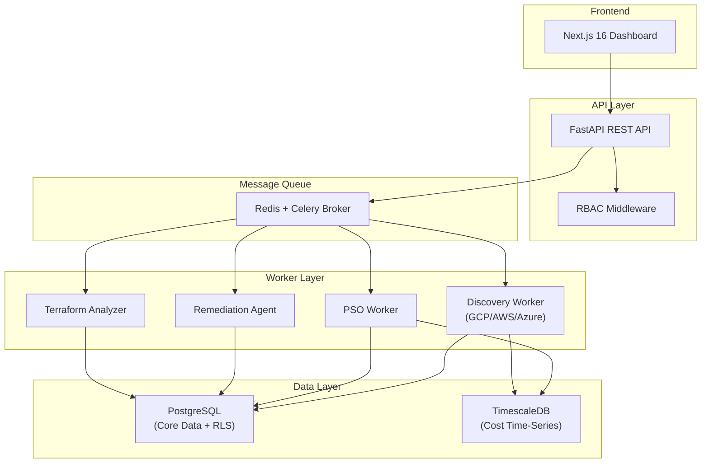
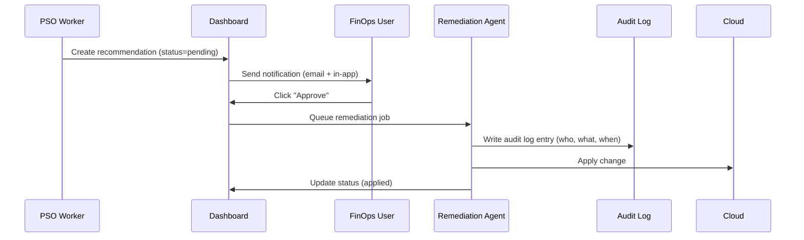

# Antigravity System Design

## Architecture Overview



**Service Boundaries:**
- **Frontend**: Next.js serves dashboard UI, real-time updates via WebSocket (optional Phase 2).
- **API Layer**: FastAPI handles authentication, authorization, job submission, data retrieval. Does not execute long-running tasks.
- **Queue**: Redis acts as Celery broker; jobs are queued and executed asynchronously.
- **Workers**: Celery workers execute discovery, PSO, remediation, and Terraform analysis independently.
- **Storage**: PostgreSQL for relational data (tenants, resources, recommendations, audit logs); TimescaleDB for cost metrics time-series.

---

## Component Descriptions

### API Layer (FastAPI)

**Responsibilities:**
- JWT-based authentication (Phase 2)
- RBAC middleware: authorize requests based on user role (FinOps/SecOps/Admin)
- Job submission endpoints: `POST /api/v1/discovery/trigger`, `POST /api/v1/remediation/request`
- Data retrieval endpoints: `GET /api/v1/resources`, `GET /api/v1/recommendations`, `GET /api/v1/audit-log`
- Terraform analyzer upload: `POST /api/v1/terraform/analyze` (accepts `.tf` files, returns violations)

**Key Endpoints:**
```python
# Resource inventory
GET /api/v1/resources?provider=gcp&region=us-central1

# Recommendations
GET /api/v1/recommendations?status=pending&confidence_gte=80
POST /api/v1/recommendations/{id}/approve  # Requires FinOps/Admin
POST /api/v1/recommendations/{id}/reject   # Logs feedback for PSO tuning

# Remediation jobs
GET /api/v1/remediation-jobs?tenant_id={id}
POST /api/v1/remediation-jobs  # Triggers approved batch

# Terraform analyzer
POST /api/v1/terraform/analyze  # Multipart upload, returns violations
```

### Worker Layer (Celery)

**Worker Types:**
- **Discovery Worker**: Pulls cloud provider APIs, normalizes schema, upserts to PostgreSQL + TimescaleDB. Runs daily cron.
- **PSO Worker**: Evaluates resource utilization data, runs particle swarm optimization, generates recommendations with confidence scores. Runs nightly.
- **Remediation Worker**: Executes approved changes with idempotency, atomicity, rollback, blast radius limits. Runs on-demand after approval.
- **Terraform Worker**: Parses HCL, applies static analysis rules, returns cost + security violations. Runs on-demand.

**Celery Configuration:**
```python
from celery import Celery

app = Celery('antigravity', broker='redis://localhost:6379/0')
app.config_from_object('celery_config')

# Priority queues
app.conf.task_routes = {
    'workers.remediation.execute': {'queue': 'critical'},
    'workers.pso.run': {'queue': 'batch'},
    'workers.discovery.sync': {'queue': 'batch'},
    'workers.terraform.analyze': {'queue': 'default'},
}
```

### PSO Engine

**Algorithm:**
- Each particle represents a resource configuration (vCPU, memory, storage type).
- Fitness function: `f = w1 * cost_savings + w2 * utilization_match + w3 * stability_penalty`
- Weights tuned via feedback loop (accepted recommendations increase weight for that factor).
- Output: Recommended configuration + confidence score (based on data completeness + historical accuracy).

**Data Requirements:**
- 30-day utilization metrics (CPU, memory, disk I/O, network).
- Cost data from cloud billing APIs.
- Resource metadata (family, region, labels/tags).

### Remediation Agent

**Four Hard Properties:**

1. **Idempotent**
   - Each remediation job has a deterministic hash: `hash(tenant_id, resource_id, target_config)`.
   - Before applying, check if current state matches target; if yes, skip (already applied).
   - Retry logic safe: re-running same job does not double-apply changes.

2. **Atomic with Rollback**
   - Pre-execution: snapshot current state (full resource config) to `remediation_snapshots` table.
   - On failure: re-apply snapshot via cloud provider API (not "undo" — explicit restore).
   - Transactional: DB updates (recommendation status, audit log) in same transaction as API call.

3. **Blast Radius Limited**
   - Max 10 changes per tenant per hour (configurable per tenant).
   - Skip resources with tag `do-not-automate` or `production` without explicit opt-in.
   - Batch execution: process recommendations in priority order (high confidence first).

4. **Observable Audit Log**
   - Append-only table: `audit_logs` with columns `(id, tenant_id, user_id, action, resource_id, before_state, after_state, timestamp, approval_ticket_ref)`.
   - Row-level security: tenants cannot DELETE or UPDATE their own audit logs.
   - Export endpoint for compliance: `GET /api/v1/audit-log/export?format=csv`.

### Terraform Analyzer Service

**Responsibilities:**
- Parse HCL using `python-librosetta` or `terraform-compliance` parser.
- Build AST of resources, data sources, providers.
- Apply rule engine:
  - **Cost rules**: "No untagged resources", "Reserved instance coverage < 50%", "No on-demand EC2 > 30 days".
  - **Security rules**: "No unencrypted S3", "No world-readable security groups", "No IAM wildcard actions".
- Output violations with line numbers, severity, suggested fix.

**Integration:**
- Separate Python service (no shared state with main system).
- Communication via REST: `POST /analyze` with multipart form data (`.tf` files).
- Results stored in PostgreSQL as `TerraformViolation` records linked to tenant.

---

## Data Models

### Tenant
```python
class Tenant(Base):
    id: UUID
    name: str
    cloud_providers: List[str]  # ["gcp", "aws"]
    maintenance_window: str     # Cron expression: "0 2 * * 6" (Saturdays 2am)
    max_changes_per_hour: int   # Default: 10
    created_at: datetime
```

### Resource
```python
class Resource(Base):
    id: UUID
    tenant_id: UUID
    provider: str               # "gcp", "aws", "azure"
    resource_type: str          # "compute_instance", "ec2", "vm"
    region: str
    current_config: JSON        # {vcpu: 4, memory_gb: 16, ...}
    utilization_metrics: JSON   # {cpu_avg: 25, mem_avg: 35, ...}
    tags: Dict[str, str]
    last_discovered: datetime
```

### Recommendation
```python
class Recommendation(Base):
    id: UUID
    tenant_id: UUID
    resource_id: UUID
    pso_run_id: UUID
    current_config: JSON
    recommended_config: JSON
    confidence_score: int       # 0–100
    estimated_monthly_savings: Decimal
    status: str                 # "pending", "approved", "rejected", "applied"
    approved_by: UUID           # User ID
    approved_at: datetime
    applied_at: datetime
    feedback_notes: str         # Why rejected? Actual savings?
```

### AuditLog
```python
class AuditLog(Base):
    id: UUID
    tenant_id: UUID
    user_id: UUID
    action: str                 # "approve", "reject", "apply", "rollback"
    resource_id: UUID
    before_state: JSON
    after_state: JSON
    approval_ticket_ref: str    # JIRA/Linear ticket
    timestamp: datetime
    # Immutable: no UPDATE, no DELETE
```

### RemediationJob
```python
class RemediationJob(Base):
    id: UUID
    tenant_id: UUID
    status: str                 # "queued", "running", "completed", "failed", "rolled_back"
    recommendations: List[UUID]
    snapshot_id: UUID           # Reference to pre-change snapshot
    started_at: datetime
    completed_at: datetime
    error_message: str
    rolled_back_at: datetime
    rolled_back_by: UUID
```

---

## Credential Management Design

### Service Account Pattern (GCP)

**Onboarding Flow:**
1. Customer creates a service account in their GCP project: `antigravity-analyzer@<project-id>.iam.gserviceaccount.com`.
2. Customer grants minimal IAM role: `roles/viewer` + `roles/billing.viewer` (least privilege).
3. Customer enables workload identity federation: allows our GCP service account to impersonate their service account.
4. Our backend exchanges JWT for short-lived credentials (no long-lived keys stored).

**Implementation:**
```python
from google.auth import impersonated_credentials

# Customer delegates to our SA
target_service_account = "antigravity-analyzer@customer-project.iam.gserviceaccount.com"
creds = impersonated_credentials.Credentials(
    source_credentials=our_sa_credentials,
    target_principal=target_service_account,
    target_scopes=["https://www.googleapis.com/auth/cloud-platform"],
    lifetime=3600  # 1 hour
)
```

### Cross-Account Role Assumption (AWS)

**Onboarding Flow:**
1. Customer creates IAM role: `AntigravityReadOnlyRole` with trust relationship allowing our AWS account to assume.
2. Attach managed policies: `SecurityAudit`, `ReadOnlyAccess`.
3. Our backend assumes role via STS:
```python
import boto3

sts = boto3.client('sts')
credentials = sts.assume_role(
    RoleArn="arn:aws:iam::CUSTOMER_ACCOUNT:role/AntigravityReadOnlyRole",
    RoleSessionName="antigravity-discovery",
    DurationSeconds=3600
)
```

### Workload Identity Federation (GCP → AWS)

**Advanced Pattern:**
- For customers using GCP workloads that need AWS access, use workload identity federation to exchange GCP tokens for AWS credentials.
- Eliminates need for AWS access keys in GCP VMs.

---

## Security Considerations

### RBAC Roles

| Role | Permissions |
|------|-------------|
| **FinOps** | View cost dashboards, view recommendations, approve cost-related changes, export billing data |
| **SecOps** | View security recommendations, approve security-related changes, view audit logs |
| **Admin** | All permissions, manage maintenance windows, manage user access, trigger discovery |

### Approval Workflow



### Maintenance Windows

- Per-tenant configuration: `maintenance_window` field as cron expression.
- Remediation worker checks window before execution:
```python
from croniter import croniter

def is_within_maintenance_window(cron_expr, now):
    cron = croniter(cron_expr, now)
    prev_run = cron.get_prev(datetime)
    return now - prev_run <= timedelta(hours=4)  # 4-hour window
```
- Jobs queued outside window remain in `pending` until window opens.

### SOC 2 Compliance

- Immutable audit logs: `DELETE` and `UPDATE` revoked via PostgreSQL RLS.
- Access logging: all API requests logged with user ID, timestamp, endpoint.
- Quarterly access reviews: export list of users with Admin role per tenant.
